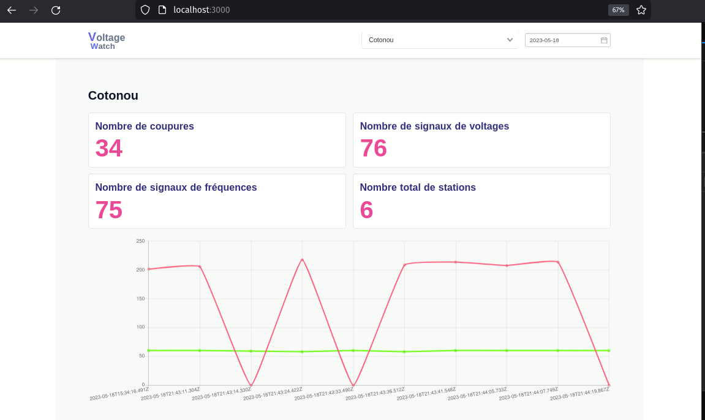

# Voltage watch
This project is the result of a hackaton1 of foxtech which lasted one day and half. 

## The Hackaton pitch
Imagine a world where every citizen has the power to monitor energy production in his or her area in
in real time. We propose to create a website that uses the voltage and frequency data provided by a dedicated
frequency data provided by a dedicated box (simulated at this stage) to provide a transparent overview of local
production, thus providing an accountability tool to improve the quality of electrical service.
electrical service.

## Demo


## Run the project

```bash
# Install dependencies
$ yarn install

# Launch the frontend (localhost:3000)
$ yarn dev

# Launch the api
$ yarn api

# Launch the the script to simulate the data generation by the boxes
node voltage/index.js

```

For detailed explanation about nuxt, check out [documentation](https://nuxtjs.org).
